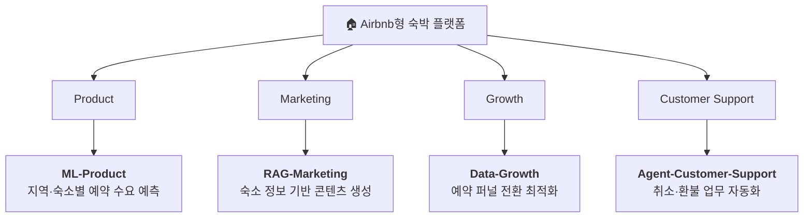
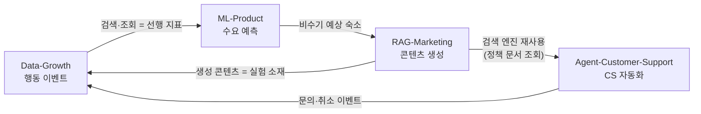

# 문수현 (MoonSuhyeon)

> **AI Agent가 업무를 수행하는 시스템을 설계하고, 그 판단을 신뢰할 수 있게 만드는 구조**에 관심이 있습니다.

LLM이 답변을 잘 만드는 것과, LLM이 **실제 업무를 실행해도 안전한 것**은 다른 문제라고 생각합니다.
그래서 만드는 시스템마다 다음 질문을 먼저 붙입니다.

- 이 판단의 **근거 데이터**는 무엇이고, 어디서 검색해 왔는가
- **틀렸을 때** 무슨 일이 벌어지고, 어떻게 멈추는가
- 사람은 **언제** 개입해야 하는가
- 잘 동작하는지를 **무슨 숫자로** 확인하는가

---

## 주력 기술

| 영역 | 기술 |
|------|------|
| 언어 | **Python** (주력), Java 17, TypeScript |
| 백엔드 | **FastAPI**, Pydantic v2, SQLAlchemy 2.0 (async), Alembic / Spring Boot 3.x |
| AI | LangGraph, OpenAI SDK, RAG (Hybrid Search · Reranking · Self-RAG), RAGAS |
| 데이터 | PostgreSQL, pandas, scikit-learn, XGBoost, statsmodels |
| 인프라 | Docker, Prometheus + Grafana, Kafka |

---

## 프로젝트

### 1. AI-Native Internet Banking

**[AI-Native-Internet-Banking](https://github.com/MoonSuhyeon/AI-Native-Internet-Banking)** · Java 17 / Spring Boot 3.x

AI Agent가 계좌·이체·대출·이상거래·고객지원 등 인터넷뱅킹 업무를 직접 수행하는 플랫폼입니다.
"사람이 화면에서 기능을 찾아 실행하는 서비스"를 **"Agent가 조회 → 분석 → 판단 → 실행 → 검증까지 수행하고, 사람은 필요한 순간에 승인하는 서비스"** 로 재설계하는 것을 목표로 합니다.

금융은 **판단이 틀렸을 때의 비용이 명확한 도메인**이라, Agent 안전장치를 설계하기에 적합한 레퍼런스로 삼았습니다.
이상거래 탐지 결과를 조사 Agent에 넘기고, 그 판단의 채택률을 계측하는 구조를 다루고 있습니다.

---

### 2. 숙박 플랫폼 — 4개 팀, 4개 시스템

Airbnb형 숙박 플랫폼을 가정하고, **하나의 서비스를 네 개의 기능 조직 관점**에서 각각 설계·구현하는 프로젝트입니다.
같은 도메인 데이터를 Product / Marketing / Growth / Customer Support가 어떻게 다르게 다루는지를 시스템으로 구현합니다.

| 레포 | 담당 영역 | 핵심 기술 | 상태 |
|------|----------|----------|------|
| **[ML-Product](https://github.com/MoonSuhyeon/ML-Product)** | 시장 수요 예측 | 시계열 회귀 · walk-forward 검증 · Quantile 예측구간 · FastAPI 서빙 | 🔨 진행 중 |
| **[RAG-Marketing](https://github.com/MoonSuhyeon/RAG-Marketing)** | 상품 상세 정보 활용 | Hybrid Search · Reranking · Self-RAG · 사실 정합성 검증 | 🔨 진행 중 |
| **[Data-Growth](https://github.com/MoonSuhyeon/Data-Growth)** | 전환 최적화 | 이벤트 택소노미 · 아이덴티티 스티칭 · 퍼널 · A/B 통계 설계 | 🔨 진행 중 |
| **[Agent-Customer-Support](https://github.com/MoonSuhyeon/Agent-Customer-Support)** | 고객 응대 자동화 | LangGraph · Tool 설계 · 멱등성 · HITL 게이트 | 🔨 진행 중 |

> 각 저장소의 README는 **구현 명세(Spec)** 입니다. 완성된 결과가 아니라 만들어 가는 목표 상태를 기술하고,
> 항목마다 `✅ 구현 완료 / 🔨 진행 중 / 🆕 예정`으로 진행 상태를 표시합니다.

#### 네 시스템이 서로 주고받는 것

독립된 네 프로젝트가 아니라, 한 플랫폼의 데이터가 순환하는 구조로 설계했습니다.

- **Data-Growth → ML-Product**: 검색·조회 이벤트를 수요 예측의 선행 지표 피처로 제공
- **ML-Product → RAG-Marketing**: 수요가 낮을 것으로 예측된 숙소를 프로모션 콘텐츠 대상으로 전달
- **RAG-Marketing → Agent**: 하이브리드 검색 엔진을 취소·환불 **정책 문서 조회**에 재사용
- **Agent → Data-Growth**: 문의·취소 이벤트를 이탈 원인 분석에 반영

---

## 설계할 때 지키는 것

네 프로젝트와 뱅킹 플랫폼에 공통으로 적용하는 원칙입니다.

| 원칙 | 의미 |
|------|------|
| **SSoT** | 데이터의 원천을 명확히 두고, AI가 없는 정보를 만들어내지 않게 한다 |
| **Retrieval Before Generation** | LLM의 기억이 아니라 검색된 근거로만 생성한다 |
| **No Silent Fallback** | 모르면 그럴듯한 답을 만들지 않고, 명시적으로 실패하거나 사람에게 넘긴다 |
| **Human-in-the-Loop** | 되돌리기 어려운 작업은 사람이 승인한 뒤에 실행한다 |
| **Idempotency** | 같은 요청이 반복돼도 결과는 한 번만 발생한다 |
| **Verify After Execute** | 실행했다고 믿지 않고, 실제 상태를 다시 읽어 확인한다 |
| **Evaluation Driven** | "잘 되는 것 같다"로 끝내지 않고 지표로 측정해 비교한다 |

---

## 그 외

- **[re-bootcamp_project_personal](https://github.com/MoonSuhyeon/re-bootcamp_project_personal)** — AXful Bank, 인터넷뱅킹 웹 서비스 (TypeScript)
