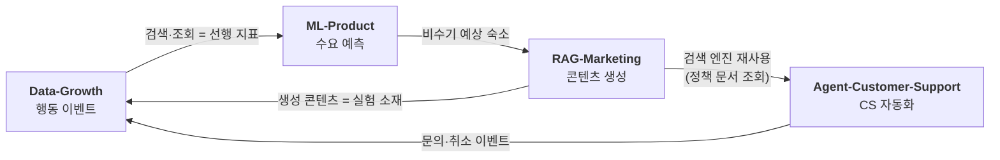

안녕하세요, MoonSuhyeon입니다 👋

**양면 시장에서는 양쪽을 연결하는 것만으로 거래가 이루어지지 않습니다.** 수요와 공급을 맞추고, 필요한 정보를 쉽게 찾게 하며, 방문을 거래로 전환하고, 거래 과정에서 발생하는 문제를 해결해야 합니다.

저는 **ML · RAG · Data · Agent**를 활용해 이러한 문제를 해결하고, **실제 거래를 만들어내는 시스템**을 설계합니다.

---

## My Projects

### 호스트와 게스트를 연결하는 숙박 플랫폼

**[ML-Product](https://github.com/MoonSuhyeon/ML-Product) · [RAG-Marketing](https://github.com/MoonSuhyeon/RAG-Marketing) · [Data-Growth](https://github.com/MoonSuhyeon/Data-Growth) · [Agent-Customer-Support](https://github.com/MoonSuhyeon/Agent-Customer-Support)**

거래를 가로막는 네 가지 문제를, 네 개의 시스템으로 나누어 해결합니다.

| 문제 | 시스템 | 접근 | 상태 |
|------|--------|------|------|
| **수요와 공급을 맞춘다** | [ML-Product](https://github.com/MoonSuhyeon/ML-Product) | 지역·숙소별 예약 수요를 예측해 가격·재고 결정에 연결 `시계열 회귀` `walk-forward 검증` `Quantile 예측구간` `FastAPI 서빙` | 🔨 |
| **필요한 정보를 쉽게 찾게 한다** | [RAG-Marketing](https://github.com/MoonSuhyeon/RAG-Marketing) | 숙소 상세정보를 검색 가능한 지식으로 만들고 세그먼트별 콘텐츠 생성 `Hybrid Search` `Reranking` `Self-RAG` `사실 정합성 검증` | 🔨 |
| **방문을 거래로 전환한다** | [Data-Growth](https://github.com/MoonSuhyeon/Data-Growth) | 예약 퍼널의 이탈 지점을 찾아 실험으로 검증 `이벤트 택소노미` `아이덴티티 스티칭` `퍼널 분석` `A/B 통계 설계` | 🔨 |
| **거래 과정의 문제를 해결한다** | [Agent-Customer-Support](https://github.com/MoonSuhyeon/Agent-Customer-Support) | 취소·환불 문의를 Agent가 조회·판단·실행까지 처리 `LangGraph` `Tool 설계` `멱등성` `Human-in-the-Loop` | 🔨 |

네 시스템은 독립된 프로젝트가 아니라, 한 플랫폼의 데이터가 순환하는 구조입니다.

> 각 저장소의 README는 **구현 명세(Spec)** 입니다. 완성된 결과가 아니라 만들어 가는 목표 상태를 기술하고,
> 항목마다 `✅ 구현 완료 / 🔨 진행 중 / 🆕 예정`으로 진행 상태를 표시합니다.

---

### 예금자와 대출자를 연결하는 금융 플랫폼

**[AI-Native-Internet-Banking](https://github.com/MoonSuhyeon/AI-Native-Internet-Banking)** · Java 17 / Spring Boot 3.x

자금 중개는 **양쪽을 연결하는 것보다 신뢰를 유지하는 것이 어려운 시장**입니다.
잘못된 이체 한 건, 놓친 이상거래 한 건이 중개 자체를 무너뜨립니다.

AI Agent가 계좌·이체·대출·이상거래·고객지원 업무를 직접 수행하되,
**조회 → 분석 → 판단 → 실행 → 검증**을 거치고 되돌리기 어려운 작업은 사람이 승인하도록 설계했습니다.
이상거래 탐지 결과를 조사 Agent에 실거래로 넘기고, 그 판단이 실제로 채택되는 비율을 계측하는 구조를 다루고 있습니다.

---

## 설계할 때 지키는 것

거래를 만드는 시스템은 **틀렸을 때 거래가 깨진다**는 점에서, 잘 동작하는 것만큼 안전하게 실패하는 것이 중요합니다.

| 원칙 | 의미 |
|------|------|
| **SSoT** | 데이터의 원천을 명확히 두고, AI가 없는 정보를 만들어내지 않게 한다 |
| **Retrieval Before Generation** | LLM의 기억이 아니라 검색된 근거로만 생성한다 |
| **No Silent Fallback** | 모르면 그럴듯한 답을 만들지 않고, 명시적으로 실패하거나 사람에게 넘긴다 |
| **Human-in-the-Loop** | 되돌리기 어려운 작업은 사람이 승인한 뒤에 실행한다 |
| **Idempotency** | 같은 요청이 반복돼도 결과는 한 번만 발생한다 |
| **Verify After Execute** | 실행했다고 믿지 않고, 실제 상태를 다시 읽어 확인한다 |
| **Evaluation Driven** | "잘 되는 것 같다"로 끝내지 않고 지표로 측정해 비교한다 |

---

## Tech Stack

| 영역 | 기술 |
|------|------|
| 언어 | **Python** (주력), Java 17, TypeScript |
| 백엔드 | **FastAPI**, Pydantic v2, SQLAlchemy 2.0 (async), Alembic / Spring Boot 3.x |
| AI | LangGraph, OpenAI SDK, RAG (Hybrid Search · Reranking · Self-RAG), RAGAS |
| 데이터 | PostgreSQL, pandas, scikit-learn, XGBoost, statsmodels |
| 인프라 | Docker, Prometheus + Grafana, Kafka |
